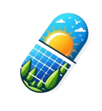

# Wide Awake Solar

**Empowering People. Transforming Energy.**

Official website for Wide Awake Solar — Ireland's solar panel installation company offering custom solar systems, battery storage, EV charging and infrared heating with SEAI grants handled in full.

🌐 [wideawakesolar.ie](https://wideawakesolar.ie) · 👁️ [Preview](https://cal-chessie.github.io/wideawakesolar/)

---

## About the Site

Single-page HTML website, fully self-contained in one `index.html` file. No build tools, no dependencies, no framework — just drop it on a server and it works.

### Sections
- Hero
- Manifesto
- Stats
- About
- How It Works
- AI Bill Analyser
- 3D Solar Simulator
- Performance
- Services
- Pricing
- Testimonials
- FAQ
- Contact

---

## Features

- **3D Solar Simulator** — Three.js powered rooftop simulator with full solar physics, SEAI grant calculator (€1,800 + €300 EV), and real-time energy output modelling
- **Mobile 2D Simulator** — Canvas-based touch simulator on mobile (≤768px) replacing Three.js for performance
- **AI Bill Analyser** — Anthropic API powered tool that reads your electricity bill and calculates solar savings
- **Cookie Consent Banner** — GDPR compliant, accept/decline, remembers choice via localStorage
- **WhatsApp Click-to-Chat** — floating button linking directly to WhatsApp for instant leads
- **Scroll Progress Bar** — branded gradient bar showing page scroll position
- **Back to Top Button** — appears after 400px scroll, smooth scroll to top
- **Print Stylesheet** — pricing section prints cleanly, nav/UI elements hidden
- **Scroll animations** — 40 animated elements, `prefers-reduced-motion` respected
- **SEO ready** — Meta tags, Open Graph, Twitter Cards, structured data
- **Fully responsive** — Mobile-first design with custom mobile nav drawer
- **No external dependencies at runtime** — Three.js and Chart.js loaded via CDN with `defer`

---

## Tech Stack

| Layer | Detail |
|---|---|
| HTML/CSS/JS | Vanilla, single file |
| 3D | Three.js r128 |
| Charts | Chart.js 4.4.1 |
| Fonts | Fraunces, Plus Jakarta Sans, DM Mono (Google Fonts) |
| AI | Anthropic Claude API |
| Images | WebP (base64 embedded) |

---

## Deployment

This is a static single-page site. Deploy anywhere that serves HTML:

- **Netlify** — drag and drop `index.html` or connect this repo for auto-deploy
- **Cloudflare Pages** — connect repo, no build command needed
- **Vercel** — connect repo, framework = Other
- **GitHub Pages** — already enabled, live at [cal-chessie.github.io/wideawakesolar](https://cal-chessie.github.io/wideawakesolar/)
- **Traditional hosting** — upload `index.html` to public root via FTP/SFTP

No build step required.

---

## Logo Files

| File | Use |
|---|---|
| `logo-pill.webp` | Favicon, nav bar, mobile drawer (8KB) |
| `logo-colour.webp` | General colour use, social media (21KB) |
| `logo-colour.png` | Print, high-res fallback (183KB) |
| `logo-white.webp` | Dark backgrounds (7KB) |
| `logo-white.png` | Print fallback (47KB) |

---

## Brand

| | |
|---|---|
| Primary | `#1B9BD4` (Sky Blue) |
| Accent | `#F5A623` (Sun Yellow) |
| Green | `#2EAA4A` (Leaf) |
| Dark | `#1565C0` (Panel Blue) |

Fonts: **Fraunces** (display) · **Plus Jakarta Sans** (body) · **DM Mono** (labels)

---

## Pre-Launch Checklist

### ✅ Done
- Favicon set to pill logo
- All images converted to WebP (83% size saving)
- Accessibility: aria-labels added to all form inputs and simulator controls
- SEO: meta tags, Open Graph, canonical URL, H1, viewport all set
- Scripts: Three.js and Chart.js deferred
- GDPR cookie consent banner
- WhatsApp click-to-chat button
- Scroll progress bar
- Back to top button
- Print stylesheet
- GitHub Pages live

### 🔲 Needs Dev / You
- **WhatsApp number** — update the `wa.me/353000000000` number in the WhatsApp button to the real business number
- **OG image** — upload a real 1200×630px image to `/og-image.jpg` on the server
- **Contact form** — connect to Netlify Forms or Formspree (one line of code)
- **Google Analytics** — replace `G-XXXXXXXXXX` with real GA4 ID from analytics.google.com
- **Real photography** — replace placeholder imagery with real Wide Awake Solar project photos

---

Built by [SolarIreland](https://solarireland.ie)
